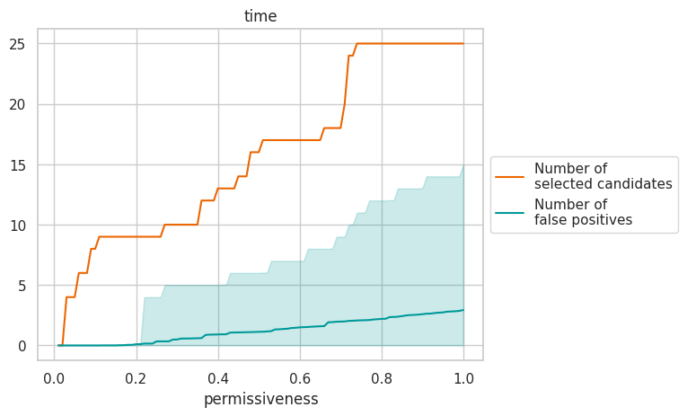

# ROBI: Robust and Optimized Biomarker Identifier

<p align="justify">
    
    ROBI is a selection pipeline that select predictive biomarkers from any set of features.
    The selection if performed with a robust and adjustable control of the number of false positives as well as a
    control for confounders.
    ROBI can control for confounders and already known biomarkers in order to select only new and relevant information.
</p>


### Keys features:
 * :balance_scale: Reliable predicitive power estimation through permutation tests instead of fixed thresholds
 * :shield: Robust control of the number of false positive
 * :heavy_plus_sign: Increased discovery rate via optimised feature selection
 * :tada: Only select new information via control for confounders and correlation with known biomarkers

[](https://badge.fury.io/py/robi)
[](https://opensource.org/licenses/Apache-2.0)
[](https://www.python.org/downloads/release/python-360/)


## :rocket: Installation 

```shell
pip install robi
```

:zap: Although [PyTorch](https://pytorch.org/get-started/locally/) is not required to use the package, ROBI runs much faster
with its PyTorch implementation. The speed gain is great on CPU, and much greater on GPU.
To use the PyTorch implementation, simply install PyTorch (conda is the easiest way), and ROBI will use it automatically.
To tell ROBI to use the GPU, set `device='cuda'` in the `robi.make_selection` function.

## :sparkles: Utilisation 


### Basic usage

First, ROBI must be imported:
```python
import robi
```

Then, a pandas dataframe need to be defined were each row is a patient, and each column a feature
(biomarker, outcome, ...), such as:
```python
print(df)
```

| outcome | candidate_1 | candidate_2 |
|---------|-------------|-------------|
| 10      | 0           | 100         |
| 25      | 0.1         | -2          |

with `candidate_1` and `candidate_2` the candidate biomarkers that we want to evaluate and `outcome` the target
(e.g. the feature that we want to be predicted by the selected biomarkers).

Then, the selection can be performed with:
```python
selection, scores = robi.make_selection(df,
                                        candidates = ['candidate_1', 'candidate_2'],
                                        targets = 'outcome')
```

`robi.make_selection` will plot the following image:

<p align="center">
  
</p>

The x axis is the degree of permissiveness: how strict is the selection. A low permissiveness means a stricter
selection, reducing the number of false positives, but at the cost of more false negatives (e.g. missed discoveries).
On the other hand, a high permissiveness means a less strict selection, increasing the number of discoveries but
at the cost of more false positives.
The orange line represent the number of selected candidates. The blue line represent the average number of false
positives. The blue area is the 95% confidence interval for the number of false positives.
If the selection is performed on multiple targets, a plot for each target is generated.

`robi.make_selection` will return two variables:
 * `selection`: contains the results of the selection for multiple level of false discovery rate.
 * `scores`: contains the results of the evaluation of the prognostic value of each candidate.

`selection` will look like this:

| target  | permissiveness | n_selected | n_FP      | P_only_FP | selected                       |
|---------|----------------|------------|-----------|-----------|--------------------------------|
| outcome | 0.01           | 1          | 0.1 (0-0) | 1e-3      | ['candidate_1']                |
| outcome | 0.02           | 2          | 0.5 (0-2) | 1e-2      | ['candidate_1', 'candidate_2'] |
| ...     | ...            | ...        | ...       | ...       | ...                            |

with:
 * `target`: on which target was the selection performed
 * `permissiveness`: degree of permissiveness for this selection
 * `n_selected`: number of selected candidates
 * `n_FP`: average number of false positives and 95% confidence interval in parentheses
 * `P_only_FP`: probability of having only false positives selected
 * `selected`: list of the selected candidates for the corresponding permissiveness


`scores` will look like this:

| candidate   | target  | C_index | p_value |
|-------------|---------|---------|---------|
| candidate_1 | outcome | 0.65    | 1e-3    |
| candidate_2 | outcome | 0.55    | 2e-2    |
| ...         | ...     | ...     | ...     |

with:
 * `candidate`: candidate to whom belong the row
 * `target`: on which target was the C-index computed
 * `C-index`: C-index of the corresponding candidate for the corresponding target 
 * `p-value`: p-value of the corresponding C-index

### :rotating_light: :warning: the C-index is anti-concordant with the targets :warning: :rotating_light:
 * a feature with a C-index > 0.5 is **negatively correlated** with the target. The **higher** the feature 
value, the **lower** the target.
 * a feature with a C-index < 0.5, is **positively correlated** with the target. The **higher** the feature 
value, the **higher** the target.

So if the target is the Overall Survival or any other survival metric, a C-index > 0.5 means that the
corresponding feature is positively correlated to the risk.

### Control for confounders

If confounders are presents in the dataset, they can be listed in the `confounders` parameter. ROBI will discard any
candidate that is sensitive to these confounders, making sure that any selected biomarker is relevant and worth
studying further.
```python
selection, scores = robi.make_selection(df,
                                        candidates,
                                        targets = 'outcome',
                                        confounders = ['age', 'sex'])
```
This way, any candidate whose hazard ratio changes by more than 10% when confounders are introduced in a Cox model,
will be discarded.

### Control for known biomarkers

If some biomarkers are already known and used, we can avoid selecting candidates that are simply replicating this known
information. For instance, if we know that tumor volume affect the outcome of patients, we can specify
`known = ['tumor_volume']`such as:
```python
selection, scores = robi.make_selection(df,
                                        candidates,
                                        targets = 'outcome',
                                        known = ['tumor_volume'],
                                        confounders = ['age', 'sex'])
```
This way, any candidate that is simply a proxy of the tumor volume will be discarded. Multiple known biomarkers can be
listed. Collinearity and multicollinearity will be tested.

### Censored target

ROBI can handle censored targets (e.g. we know that a patient was alive until a certain date, but then we don't if
he died or when). For instance, to use the Overall Survival (OS), one must specify:
```python
selection, scores = robi.make_selection(df,
                                        candidates,
                                        targets = {
                                            'OS': ('OS_time', 'OS_happened')
                                        })
```
with `OS_time` being the time between diagnosis and death or end of study, and `OS_happened` a boolean feature 
stating if a patient died (True or 1) or not (False or 0) during the study.

### Multiple targets

ROBI can perform the biomarker selection for multiple targets at the same time. For instance, the candidates could be
evaluated for OS and Progression Free Survival (PFS). Simply pass them to the `targets` parameter as a dictionary:
```python
selection, scores = robi.make_selection(df,
                                        candidates,
                                        targets = {
                                            'PFS': ('PFS_time', 'PFS_happened'),
                                            'OS': ('OS_time', 'OS_happened')
                                        })
```
The key of the dictionary is the name of the target. The first element of the tuple is the time, the second says if
the event happened or not.

When giving multiple targets, some could be censored while other might be uncensored. Give them like in the following
example:
```python
selection, scores = robi.make_selection(df,
                                        candidates,
                                        targets = {
                                            'uncensored_target': ('uncensored_target'),
                                            'censored_target': ('censored_target_time', 'censored_target_happened')
                                        })
```

### other parameters

## :memo: Examples
You can find example notebooks in the `notebooks` folder of this repository.

radiomic DLBCL
TCGA
synthetic data


## :mag: Pipeline diagram


## :technologist: Author

Louis Rebaud: [louis.rebaud@gmail.com](mailto:louis.rebaud@gmail.com)


## :page_facing_up: License

This project is licensed under the Apache License 2.0 - see the LICENSE.md file for details
